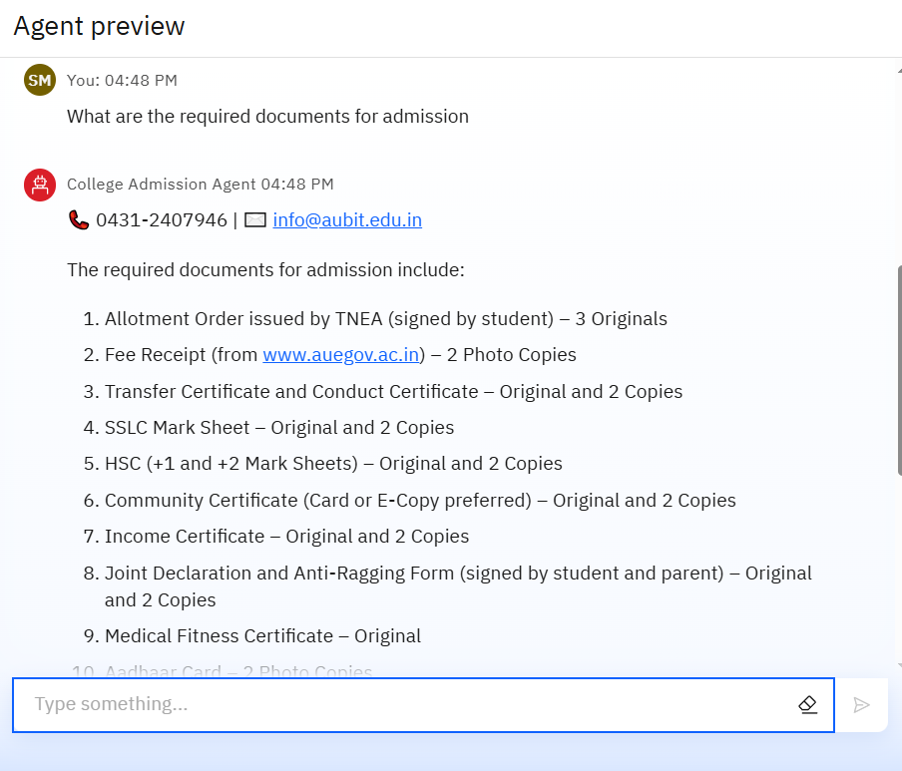
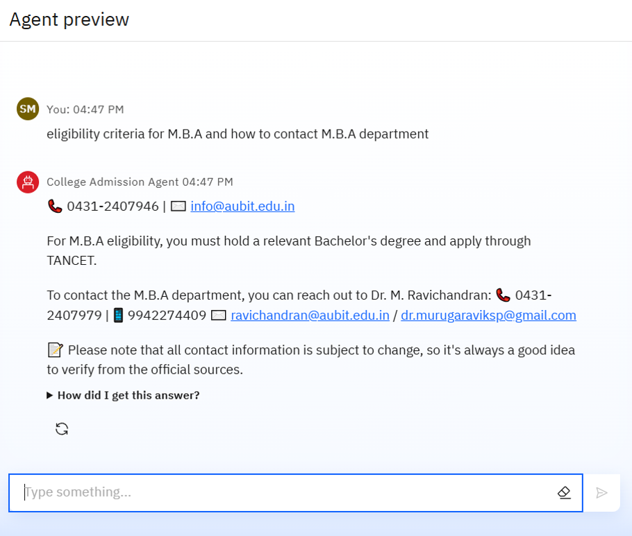
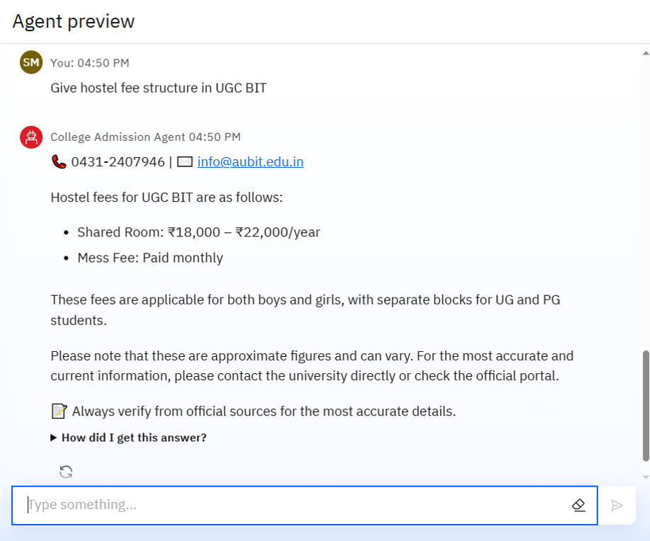

# 🎓 College Admission Agent (RAG-Based AI Assistant)

This AI-powered College Admission Agent simplifies the student admission process by providing instant, accurate, and document-based answers to frequently asked questions regarding programs, fees, eligibility, documents, and department contacts at **University College of Engineering (UCE), BIT Campus, Tiruchirappalli**.


---

## 📌 Problem Statement

Prospective students often face difficulties finding clear and reliable information about courses, eligibility, fees, deadlines, and required documents. Manual inquiries overload administrative departments and delay decision-making for applicants.

---

## 💡 Proposed Solution

A Retrieval-Augmented Generation (RAG) based **Admission Assistant** that interacts in natural language and answers admission-related queries directly from trusted institutional documents. It improves transparency, accessibility, and efficiency in college admissions.

---

## 🚀 Technologies Used

* **IBM Cloud Lite Services**
* **Watsonx.ai / IBM Watson Assistant**
* **IBM Granite Foundation Model**
* **Natural Language Processing (NLP)**
* **RAG (Retrieval Augmented Generation)**
* **Document Vector Store for Contextual Retrieval**

---

## 🌟 Wow Factors

* Reduces manual inquiry and administrative workload
* Ensures 100% document-based responses—no hallucinations
* Provides 24x7 support for prospective students
* Easily updatable with new academic year documents
* Increases applicant satisfaction and engagement

### 🔍 Unique Features

* Natural language support for student queries
* Searchable across uploaded college documents
* Auto-structured responses with official contact info
* Filters by course, department, or category
* Future support for multilingual and voice-based interaction

---

## 👥 End Users

* Prospective Students
* Parents/Guardians
* College Administrative Staff
* Admission Counselors

---

## 🧪 How It Works

1. User asks a natural language question (e.g., *"What are the eligibility criteria for MBA?"*)
2. The agent uses document search (RAG) to find the exact answer from institutional files
3. It generates a clear, structured response ending with:

   ```
   📞 0431-2407946 | ✉️ info@aubit.edu.in
   ```

---

## 📱 Future Scope

* **Multilingual Query Support** – Assist students in regional languages
* **Voice-Based Admission Assistant** – Enable voice-based queries for accessibility
* **Real-Time University Portal Integration** – Fetch live updates on admissions and deadlines
* **Mobile App Deployment** – Anytime-anywhere access via smartphones
* **AI-Powered Counseling** – Recommend courses based on student profiles
* **Chat-Based Document Submission Guide** – Interactive checklist and verification assistant

---

## ✅ Output Pages



---



---



---

## ✅ Conclusion

This Admission Assistant enhances the student experience by making verified information easily accessible. It supports the college in reducing manual effort and enables informed decision-making for applicants through real-time, document-backed answers.

---
## 🔗 IBM Certifications

Journey to Cloud: Envisioning Your Solution - (https://www.credly.com/badges/40ad03af-ce2b-4737-8ceb-199a95f2500f/public_url)
Getting Started with Artificial Intelligence - (https://www.credly.com/badges/8c370f48-487a-44df-87fb-e43be5c66a66/public_url)

---

## 🔗 Official Website

Visit [https://www.aubit.edu.in](https://www.aubit.edu.in) for additional information.


